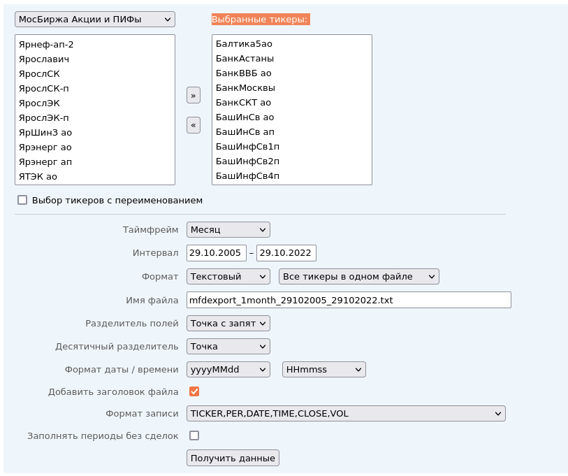

# Котировки акций и дивиденды

Результирующий файл в формате csv - [здесь](https://github.com/poserg/sturdy-doodle/raw/main/rsrc/full_result.csv).

# Котировки акций
## Самый простой вариант
Взять скаченный архив месячных котировок с 17.10.2006 по 17.10.2022 [tickers_20221029.zip](https://github.com/poserg/sturdy-doodle/raw/readme/rsrc/tickers_20221029.zip).

## Загрузка котировок вручную

Ресурс https://mfd.ru/export/ аналогичен finam.ru, но здесь можно выгружать котировки сразу по нескольким бумагам, что экономит время. Чтобы выгрузить данные по нескольким бумагам, необходимо:
1. из поля слева выбрать те, что нужны и перенести в поле "Выбранные тикеры";
2. указать интервал (если интерактивно нельзя выбрать нужный период, то можно вписать необходимый год вручную);
3. нажать кнопку "Получить данные".


У этого метода есть одна проблема. Если выбрать слишком много котировок, то запрос может не выполниться из-за ограничение на количество символов в запросе. Поэтому с помощью способа 2 можно скачать все файлы.

Плюс, нужно перепроверять. Например, для Сбербанка-пр в июле 2007 какие-то левые значения. Но на Финаме аналогичная проблема.

## Загрузка котировок в автоматическом режиме

В [tickers.txt](./rsrc/tickers.txt) загружены все идентификаторы для МосБиржи. Поэтому при наличии среды Linux можно выполнить следующий скрипт:

```bash
mkdir out
cd out
for i in `cat ../tickers.txt | cut -f1 -d\; `
do
wget https://mfd.ru/export/handler.ashx/mfdexport_1month_17102006_17102022.txt\?TickerGroup\=11\&Tickers\=$i\&Alias\=false\&Period\=9\&timeframeValue\=1\&timeframeDatePart\=day\&StartDate\=17.10.2006\&EndDate\=17.10.2022\&SaveFormat\=0\&SaveMode\=0\&FileName\=mfdexport_1month_$i.txt\&FieldSeparator\=%3b\&DecimalSeparator\=.\&DateFormat\=yyyyMMdd\&TimeFormat\=HHmmss\&DateFormatCustom\=\&TimeFormatCustom\=\&AddHeader\=true\&RecordFormat\=2\&Fill\=false
done
```

Скрипт скачает все котировки начиная с 17.10.2006 по 17.10.2022 по месяцам. 

# Дивиденды

## Настройка окружения

```bash
pipenv install
pipenv shell
```

## Загрузка и суммирование дивидендов
Дивиденды загружаются с сайта dohod.ru. Образцы url - [здесь](./rsrc/dividends_links.txt).

Загрузить дивиденды и просуммировать по годам:
```bash
./calc_div.py https://www.dohod.ru/ik/analytics/dividend/sberp -p Y
``` 

По умолчанию, данные загружаются с 2006 по 2022 год. 

Загрузить данные и просуммировать по кварталам с указанием интервала:
```bash
./calc_div.py https://www.dohod.ru/ik/analytics/dividend/sberp -sy 2012 -ey 2018 -p Q 
```

# Сопоставление акций и дивидендов

Настройка окружения аналогична [пункту](#%D0%BD%D0%B0%D1%81%D1%82%D1%80%D0%BE%D0%B9%D0%BA%D0%B0-%D0%BE%D0%BA%D1%80%D1%83%D0%B6%D0%B5%D0%BD%D0%B8%D1%8F) из дивидендов.

## Переименование файлов с котировками акций

Соответствие между акциями и облигациями происходит по именам из [файла ссылок на дивидендов](./rsrc/dividends_links.txt) и названиям файлов с котировками акций. Т.к. по умолчанию они не совпадают, то приходится переименовывать следующим скриптом:

```bash
for i in `ls`
do
	nn=`sed -n 2p $i | grep "^[^;]\+" -o`
	mv $i $nn
done

./rename.sh
```

Скрипт для переименования получен следующим скриптом:
```bash
IFS=$(echo -en "\n\b")
for i in `ls *.txt -b`
do
	nn=$(sed -n 2p $i | grep "^[^;,]\+" -o)
	cn=$(basename -s .txt $i)
	if [ "$nn" != "$cn" ]; then
        printf "%q\n" "mv $nn.txt $cn.txt"
	fi
done
```

## Вывод котировок акций

После всех перечисленных шагов выше, можно вывести котировки акций с 2006 года по 2022 следующей командой:
```bash
./calc_equities.py
```

Готовый результат [здесь](./rsrc/result.txt).

## Получение квартальных котировок

Квартальные котировки акций очень быстро можно получить распарсив файл с месячными котировкам следующей командой:
```bash
grep ",[0-9][0-9][0-9][0-9]\(12\|06\|03\|09\)[0-9][0-9]," SBERP_060101_221007.txt | cut -f5 -d, 
```
