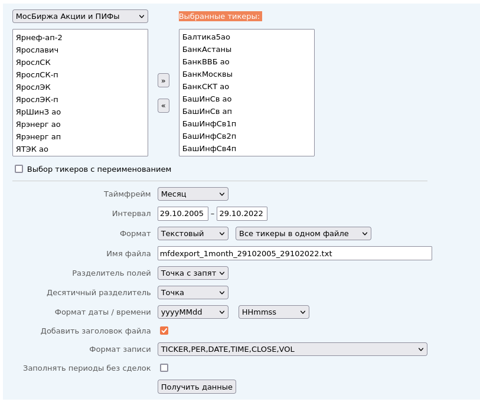

# Самый простой вариант
Взять скаченный архив месячных котировок с 17.10.2006 по 17.10.2022 [tickers_20221029.zip](https://github.com/poserg/sturdy-doodle/raw/readme/rsrc/tickers_20221029.zip).

# Загрузка котировок вручную

Ресурс https://mfd.ru/export/ аналогичен finam.ru, но здесь можно выгружать котировки сразу по нескольким бумагам, что экономит время. Чтобы выгрузить данные по нескольким бумагам, необходимо:
1. из поля слева выбрать те, что нужны и перенести в поле "Выбранные тикеры";
2. указать интервал (если интерактивно нельзя выбрать нужный период, то можно вписать необходимый год вручную);
3. нажать кнопку "Получить данные".


У этого метода есть одна проблема. Если выбрать слишком много котировок, то в запросе может не выполниться из-за ограничение на количество символов в запросе. Поэтому с помощью способа 2 можно скачать все файлы.

Плюс, нужно перепроверять. Например, для Сбербанка-пр июля 2007 какие-то левые значения.

# Загрузка котировок в автоматическом режиме

В [tickers.txt](./rsrc/tickers.txt) загружены все идентификаторы для МосБиржи. Поэтому при наличии среды Linux можно выполнить следующий скрипт:

```bash
for i in `cat ../tickers.txt | cut -f1 -d\; `
do
wget https://mfd.ru/export/handler.ashx/mfdexport_1month_17102006_17102022.txt\?TickerGroup\=11\&Tickers\=$i\&Alias\=false\&Period\=9\&timeframeValue\=1\&timeframeDatePart\=day\&StartDate\=17.10.2006\&EndDate\=17.10.2022\&SaveFormat\=0\&SaveMode\=0\&FileName\=mfdexport_1month_$i.txt\&FieldSeparator\=%3b\&DecimalSeparator\=.\&DateFormat\=yyyyMMdd\&TimeFormat\=HHmmss\&DateFormatCustom\=\&TimeFormatCustom\=\&AddHeader\=true\&RecordFormat\=2\&Fill\=false
done
```

Скрипт скачает все котировки начиная с 17.10.2006 по 17.10.2022 по месяцам. 
